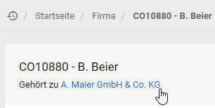
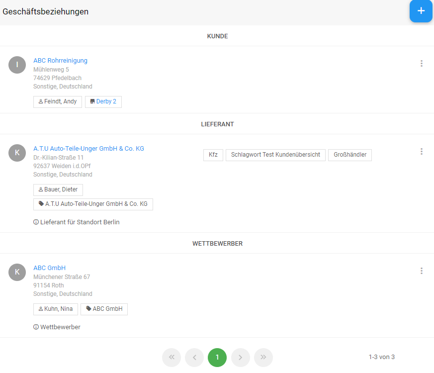
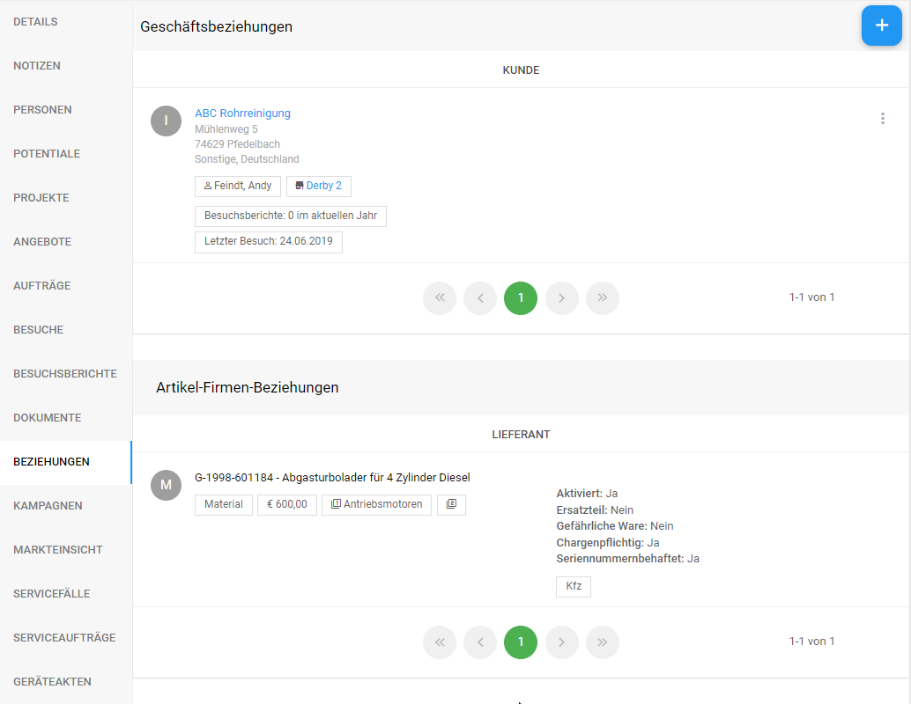
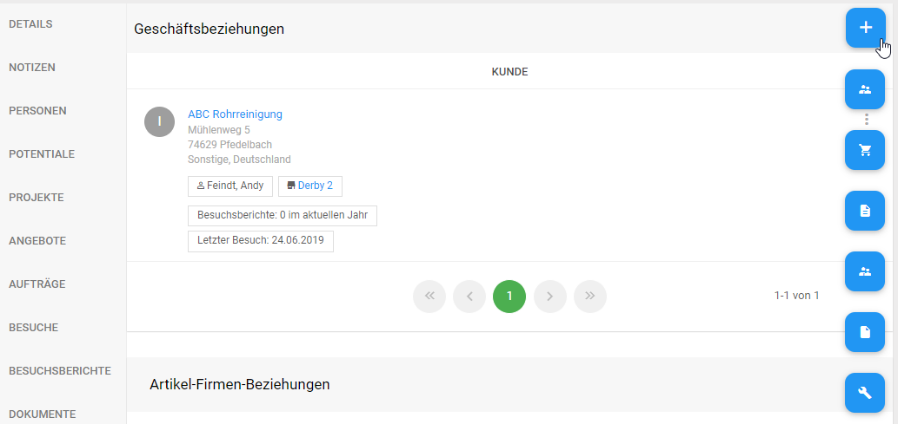
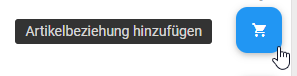
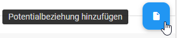
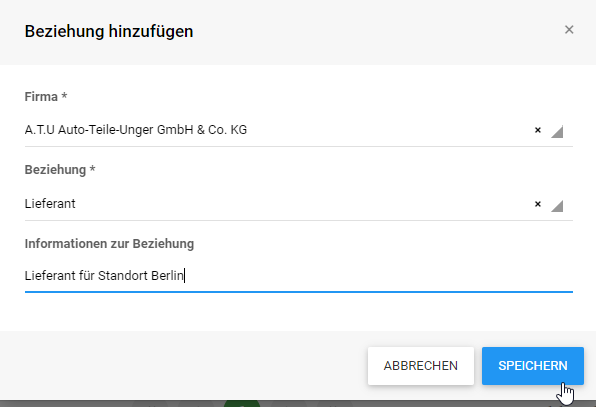
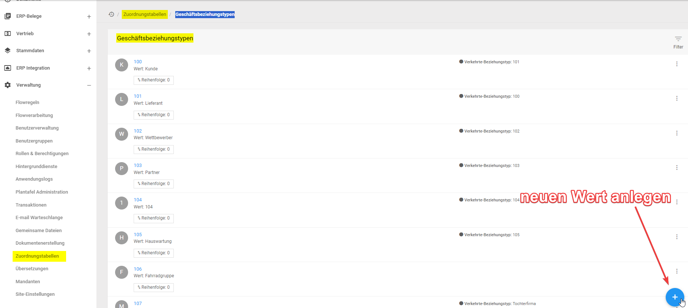
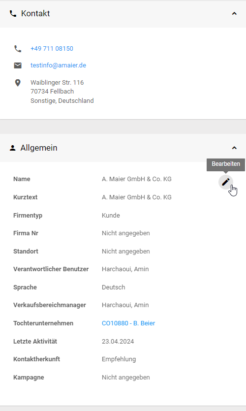
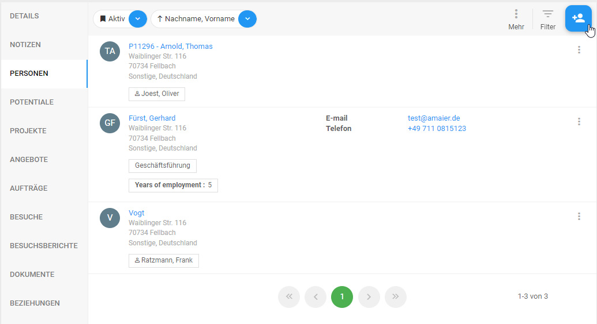

# Objektdetails - Firma
Zusätzlich zu den im Kapitel Objektdetails aufgeführten Funktionen stehen für Firmen noch weitere Funktionen zur Verfügung die hier im weiteren vorgestellt werden sollen.

## Kopfdarstellung - Zugehörigkeit
Wurde bei der Anlage der Firma ein *Mutterunternehmen* angegeben findet sich in der Kopfdarstellung der *Tochter* ein Verweis auf die Mutter. Mit Hilfe des Verweis kann die Detaildarstellung der Mutter aufgerufen werden.

## Beziehungen {#relationships}

Beziehungen zwischen Objekten können genutzt werden um zusätzlich zu einer streng hierarchischen Struktur ein Netzwerk von Objekten zu bilden. Dabei kann innerhalb der Beziehung unterschieden werden:

- Beziehungen die in beide Richtungen gleich wirken z.B. Wettbewerber
- Beziehungen die unterschiedlich in beide Richtungen wirken z.B. Kunde / Lieferant
- Beziehungen die nur in eine Richtung wirken

---

## Anwendungsbereich - Beziehungen
Aktive Beziehungen werden nach Ihrem Beziehungstyp gruppiert und in einer Liste dargestellt. Vorhandene Beziehungen können bearbeitet oder entfernt werden. 

Neue Beziehungen werden mit Hilfe der Kontextfunktion *Geschäftsbeziehung hinzufügen* eingerichet.

Sie haben verschiedene Formen der Beziehung zur Auswahl: 

---

---

---

---

---

---

Im angebotenen Formular haben Sie die Möglichkeit Informationen zur Gegenseite, Art der Beziehung und weiterführende Informationen zu erfassen.

----

Die angebotenen Beziehungsarten werden in einer Zuordnungstabelle pro Objekt gepflegt und können auf Ihre Bedürfnisse angepasst werden. Z.B. **Geschäftsbeziehungstypen**:

----

## Kontext - Kontaktinformationen
Zu einer Firma kann eine Liste von Adressen gespeichert werden. Die Adressliste bildet die Grundlage um z.B. diesen Adressen einzelne Personen zuzuweisen.

Neue Adressen können mit Hilfe der Funktion *Hinzufügen* zur geöffneten Firma erfasst werden.

Jeder Adresse kann eine Reihe von Kommunikationsdaten zugeordnet werden um z.B. verschiedene Kontaktmöglichkeiten an den unterschiedlichen Adressen abzubilden. Per Definition kann jeder Firma genau eine __Standardadresse__ zugewiesen werden. Verfügt eine Firma über mehr als eine Adresse kann die Standardadresse mit Hilfe der Funktion *Zur Standardadresse machen* verändert werden.

Vorhandene Adressen können mit dem Verweis auf die *VCard* pro Adresse heruntergeladen werden und so z.B. in Outlook importiert werden.

## Kontext - Personen bei dieser Firma
Im Kontext der Firma wird eine Liste von Personen angeboten. Diese Personen sind sowohl der Firma als auch einer der gespeicherten Adressen der Firma zugeordnet. Die Darstellung kann zwischen aktiven und inaktiven (ausgeschiedenen) Personen umgeschaltet werden.

Zu jeder Person wird ein Verweis auf die Detaildarstellung sowie weiterführende Informationen und primäre Kommunikationsdaten angeboten. Besonders relevante Personen können mit Hilfe einer Kennzeichnung von anderen unterschieden werden.
