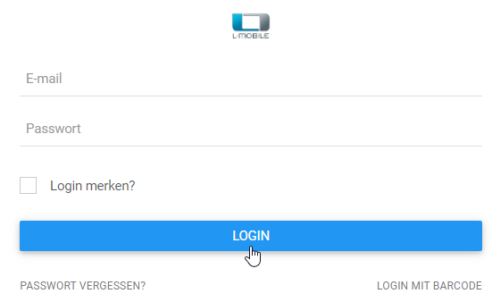
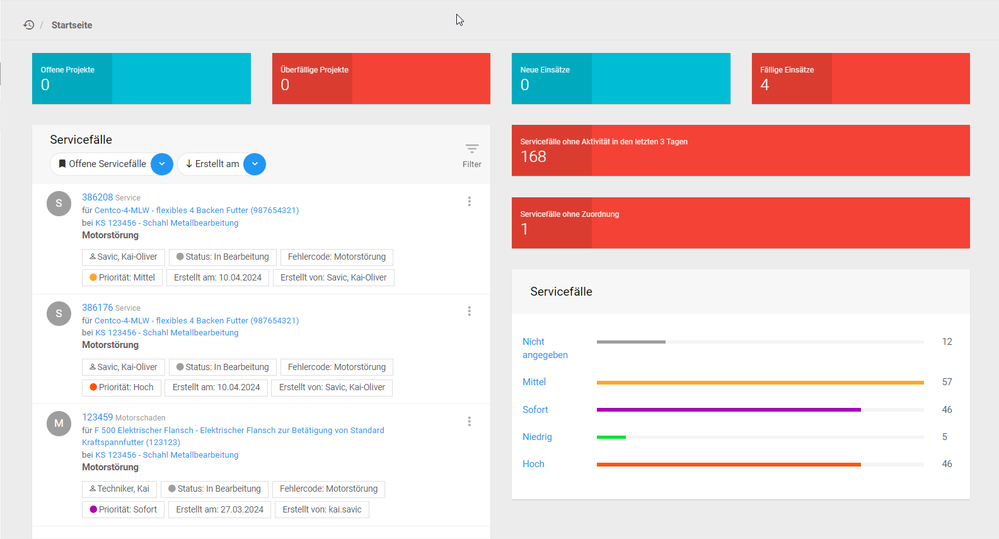
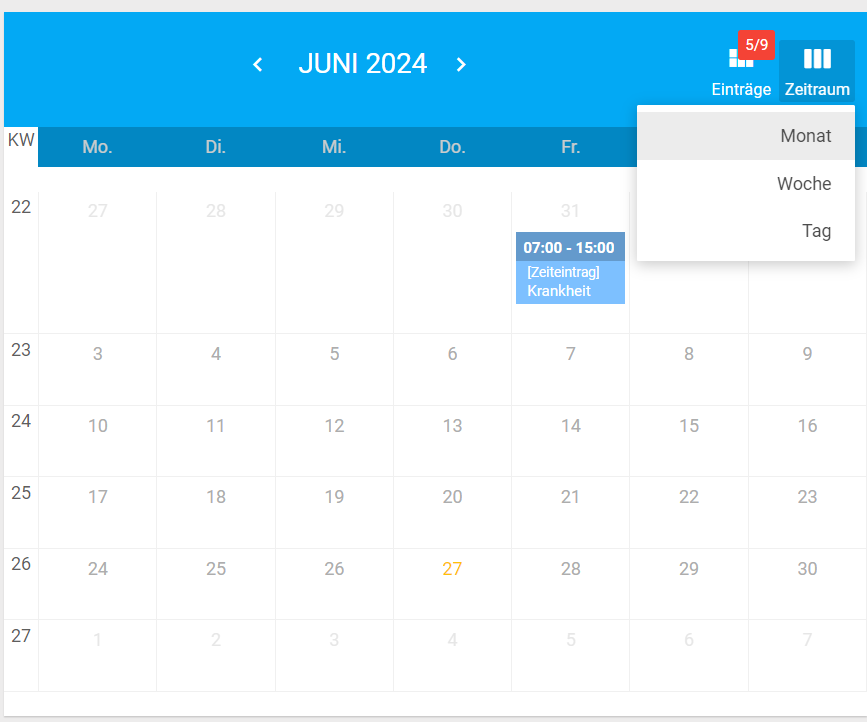
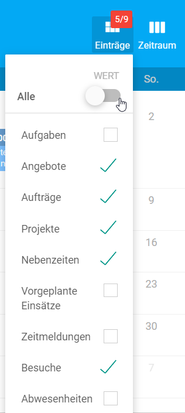





# Anmeldung an das System {#login}

Sie starten die Anwendung durch Aufruf der Adresse unter der die Anwendung für Sie bereitgestellt wurde. Nachdem Sie die Seite in Ihrem Browser geöffnet haben erfolgt die Anmeldung mit Hilfe des bereitgestellten Anmeldeformulars.

---

Möchten Sie sich in die Software anmelden, dann benötigen Sie Ihre Zugangsdaten:
Ihre **E-Mail** und ihr **Kennwort** oder mit der Hilfe von einem **Barcode**.
Sie können einen **Haken zum angemeldet bleiben setzen**, falls sie Ihr Endgerät alleine nutzen und den Anmeldeprozess in der Zukunft zu beschleunigen wollen.
Haben Sie ihr Kennwort vergessen können Sie dies über die **Passwort vergessen Schaltfläche** ändern. Sie benötigen jedoch Ihre entsprechende E-Mail. 
Haben sie einen Barcode erhalten können Sie diesen über Ihre **Gerätekamera** einlesen lassen, dafür werden Sie gegebenenfalls nach einer **Berechtigung** zur Nutzung Ihrer Kamera gefragt.

*Kennen Sie Ihre E-Mail nicht, sollten Sie mit ihrer Administration in Kontakt treten.*

__Hinweis__ Die Anmeldung erfolgt wahlweise über die integrierte L-mobile Benutzerverwaltung (via E-Mail und Passwort) oder über die Integration eines LDAP Servers. In diesem Fall erfolgt die Anmeldung mit Ihren bekannten Windows Anmeldedaten und dem auf dem LDAP System zugeordneten Passwort.

---

Nach ihrer Anmeldung, begrüßt Sie entsprechend ihren Rechten ein Options-Menu, in dem Sie auswählen können ob Sie die Oberfläche des Außendienstes, des Innendienstes oder des Video-Support Clients nutzen wollen. Der Außen- und Innendienst haben ähnliche Oberflächen wobei der Außendienst eine für seine Anforderungen reduzierte Oberfläche nutzt. Die Navigation bei Außen- und Innendienst sind hierbei gleich, beide werden mit dem Dashboard begrüßt.

## Dashboard {#dashboard}

Auf dem Dashboard oder auch Startseite genannt finden Sie mehrere **Interaktive Schaltflächen** die Ihnen den Status Ihrer

- Offenen Projekte,
- Überfällige Projekte,
- Neuen Einsätze,
- und Fälligen Einsätze

aufzeigen.

Durch das Ausführen der Schaltflächen gelangen Sie zu der Übersicht Ihrer Projekte beziehungsweise zur Übersicht Ihrer Einsätze. Dadurch haben sie bereits beim öffnen des Dashboards einen direkten Überblick über die Anzahl der Ihnen zugeteilten Aufgaben.

Direkt unter den interaktiven Schaltflächen finden Sie eine Schnellansicht ihrer heutigen Einsätze, Sie finden dort Informationen über die Art des Einsatzes, den Kunden, das Gerät, die Geräteakte die Adresse, die vorgesehene Uhrzeit und Dauer und z.B. die Fehlermeldung eines Gerätes.
Durch Ausführen der interaktiven Schaltflächen im Körper der Schnellansicht können Sie direkt zur Detailansicht des Einsatzes, des Kunden, des Serviceobjekts und der Geräteakte navigieren.
Sie können an den drei Punkten rechts von der vorgesehen Uhrzeit den Einsatz anzeigen lassen, den Bericht herunterladen oder den Einsatz zurückweisen.
Möchten Sie zwischen Ihren heutigen Einsätzen Navigieren können Sie dies über die Pfeile unterhalb der Einsatzdetails.
Falls Sie sich alle für heute anstehenden Einsätze, also auch die Einsätze Ihrer Mitarbeiter, anzeigen lassen wollen, können Sie dies über das Lesezeichensymbol in der linken Ecke der Schnellansicht.

Möchten Sie in kurzer Zeit sich die Details eines Kunden anzeigen lassen, können Sie dies über die Firmenkontaktsuche. Geben Sie einfach in das Formular die Ihnen bekannten Informationen ein.

Um eine erweiterte Übersicht der ihnen zugeteilten/erbrachten Termine zu erhalten finden Sie auf dem Dashboard auch einen Kalender.

Über die drei vertiklalen Linien in der oberen rechten Ecke des Kalenders können Sie einstellen welche Ansicht Sie bevorzugen, Monats-, Wochen- oder Tagesansicht, über die Pfeile können Sie zwischen den von ihnen gewählten Zeitabschnitten navigieren. Möchten Sie die Art der Termine Filtern können Sie dies über das Symbol links neben den drei Linien.

---

<!-- BEGIN MANUAL -->





















<!-- END MANUAL -->
