# Benutzerverwaltung, Rollen- und Benutzergruppenverwaltung {#user-manager.user-manager}

Die Benutzerverwaltung ist die zentrale Stelle, um Benutzer der *Desktopanwendung*, wie auch der *mobilen Endgeräte* zu verwalten. Die Benutzerverwaltung befindet sich im ***Burger-Menü* unter *Verwaltung***. Direkt darunter befindet sich die Verwaltung für Benutzerrollen und Benutzergruppen.

## Aufgabe der Benutzerverwaltung

Die Aufgabe der Benutzerverwaltung geht über das Anlegen, Löschen und Bearbeiten der Benutzer hinaus. So besteht eine weitere Aufgabe in der Zugriffssteuerung auf Funktionen und Dateninhalt.

## Zugriffssteuerungsmodell {#user-manager.authorization-model}

Die Zugriffssteuerung ist über zwei Varianten möglich:

 1. Rollen, Berechtigungen für die Zugriffssteuerung auf Funktionen
 2. Benutzergruppen, Standorte für die Zugriffssteuerung auf Dateninhalte

*Erste Variante*

In der ersten Variante geht es im Kern um den Abgleich von Berechtigungen. Zum einen hat eine Funktion eine bestimmte Berechtigung. Zum anderen besitzt jeder Benutzer in der Regel eine Vielzahl verschiedener Berechtigungen. Möchte nun ein Benutzer eine Funktion ausführen, wird geprüft, ob dieser die Berechtigung der Funktion besitzt. Berechtigungen können Benutzern indirekt über Rollen zugeteilt werden.

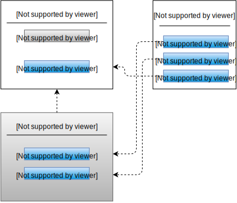

*Zweite Variante*

Eine weitere Möglichkeit besteht in der Sichtbarkeitssteuerung der Dateninhalte. In dieser zweiten Variante werden nur Dateninhalte angezeigt, die für den angemeldeten Benutzer relevant sind. Dazu werden Benutzergruppen erstellt und diesen Benutzern zugeteilt.

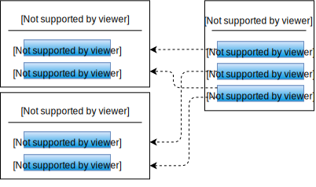

## Benutzerbezogene Daten {#user-manager.user-data}

Für jeden Benutzer lassen sich benutzerbezogene Daten speichern. Neben den nicht weiter erklärungsnotwendigen Daten, wie Name, Emailadresse etc., gibt es weitere Daten, die folgend erklärt werden.

### Token {#user-manager.token}

Der Token ist ein Identifikationsschlüssel, der zur Autorisierung verwendet wird. Jeder Benutzer hat einen eindeutigen Token, der kein weiteres Mal in der Anwendung vorkommt.

Folgende Module verwenden die Autorisierung mittels Token:

- RSS-Feed abonnieren (bspw. in Menü: Servicefälle, Serviceaufträge, Projekte)
- Kalender abonnieren (bspw. in Menü: Projekte)
- Plantafel

Möchte ein Benutzer eines dieser Module verwenden, so muss dieser im Besitz eines Token sein.

----
**Hinweis** Der Token wird nicht automatisch beim Anlegen eines Benutzers erstellt, sondern erfolgt explizit durch die entsprechende Funktion in der Benutzerverwaltung. Wurde ein Token einmal erstellt kann das Zurücksetzen des Tokens lediglich erforderlich sein, wenn eine unautorisierte Person Zugang zu dem Token erhalten hat. Für diese unautorisierte Person ist es in diesem Fall bspw. möglich, Nachrichten aus RSS-Feeds zu lesen.
Nachdem der Token zurückgesetzt wurde, ist es erforderlich die Abonnements neu zu erstellen, da sich der Link geändert hat.

----

### Im Dienst bis

Diese Funktion bietet die Möglichkeit einen Benutzer nach dem Ablauf des ausgewählten Datums automatisch zu inaktivieren. Nach der Inaktivierung eines Benutzers kann sich dieser nicht mehr Anmelden und kann die Anwendung nicht mehr verwenden.
Mit dieser Funktion lässt sich bereits zu dem Zeitpunkt, wenn das Ausscheiden eines Mitarbeiters aus dem Unternehmen bekannt wird, das Datum dessen Inaktivierung festlegen.

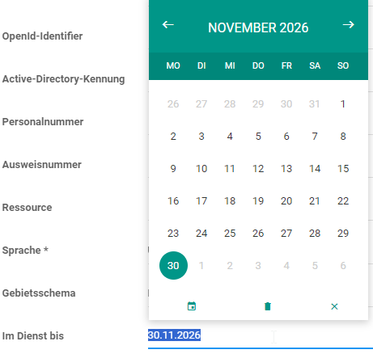

----
**Hinweis** Diese Eingabe ist nur beim *Bearbeiten* eines Benutzers möglich und nicht bei *neuen Benutzer anlegen*.

----

### Sprache

Die Sprache kann für jeden Benutzer individuell eingestellt werden. Diese Einstellung wirkt sich auf die gesamte Anwendung, mit den mobilen Endgeräte, aus.
Die Anwendung muss neu geladen werden um die neu eingestellte Sprache zu aktualisieren.

----
**Hinweis** Die kulturabhängige Formatierung von Datum und Zahlen ist abhängig von der im Browser eingestellten Sprache.

----

### Active Directory Kennung

Die Anmeldung am System kann entweder durch die L-mobile **integrierte Benutzerverwaltung** oder über Microsofts Verzeichnisdienst **Active Directory** erfolgen. Ist Zweites gewünscht, so ist es erforderlich, dass jeder Benutzer im *Active Directory* registriert wird und die *Active Directory Kennung* der Benutzer in das gleichnamige Eingabefeld in der L-mobile Benutzerverwaltung eingetragen wird. Ansonsten ist keine Anmeldung möglich.

----
**Hinweis** Standardmäßig ist die L-mobile integrierte Benutzerverwaltung aktiviert. Bitte wenden Sie sich an L-mobile, wenn Sie eine Umstellung auf *Active Directory* wünschen. Der Benutzer meldet sich nach der Umstellung auf *Active Directory* mit den im *Active Directory* hinterlegten Anmeldedaten an.

----

### Standard Lager (Plug-In: CRM/Service) {#user-manager.default-store}

Für die Bereitstellung von Ware kann jedem Mitarbeiter ein *Standard Lager* und *Standard lagerplatz* zugeordnet werden. Das *Standard Lager* ist hierarchisch über dem *Standard Lagerplatz* angesiedelt.

Ein Beispiel für *Standard Lager* ist *Servicelager*.

### Standard Lagerplatz (Plug-In: CRM/Service) {#user-manger.default-location}

An dem *standard Lagerplatz* kann Ware für den Mitarbeiter gelagert werden. Sehen Sie dazu auch das Kapitel [Standard Lager](#user-manager.default-location).

Ein Beispiel für *Standard Lagerplatz* ist *Servicewagen 5*.

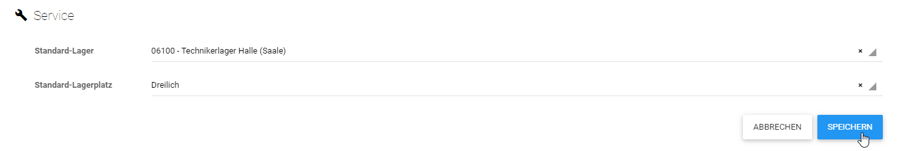

### Rollen / Berechtigungen / Benutzergruppen
Bitte sehen Sie das entsprechende Kapitel [Rollen](#user-manager.rolls) und [Benutzergruppen](#user-manager.user-groups) hierzu.

## Benutzer {#user-manager.user}
Eine Auflistung aller Benutzer befindet sich im Anwendungsbereich der Benutzerverwaltung.

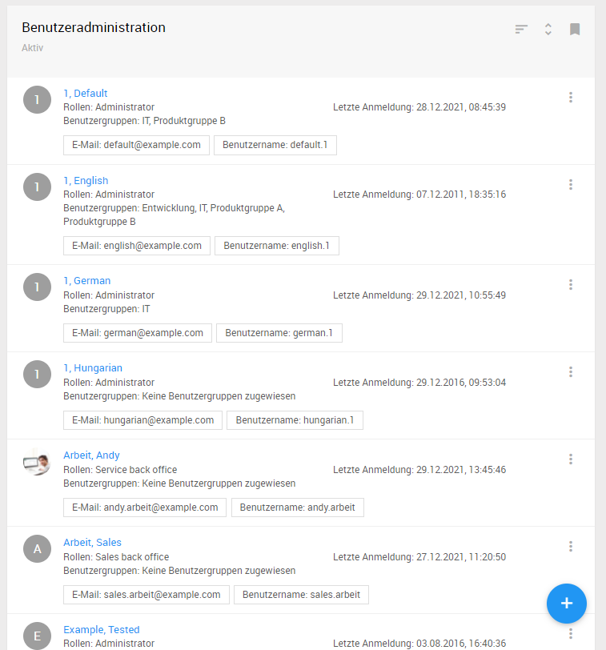

### Aktive / Inaktive Benutzer
Der Anwendungsbereich zeigt die registrierten Benutzer. Über die Lesezeichen-Schaltfläche können die angezeigten Benutzer nach *aktiven* und *inaktiven* Benutzer gefiltert werden.

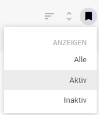

Folgende Funktionen lassen sich auf jeden registrierten Benutzer anwenden:

- Details
- Passwort zurücksetzen
- Benutzer (De)aktivieren

### Details
Alle benutzerbezogene Daten können hier geändert werden. Dazu gehören Vorname, Name und Emailadresse, wie auch die Zugehörigkeit zu Rollen und Benutzergruppen und der Besitz von expliziten Berechtigungen.

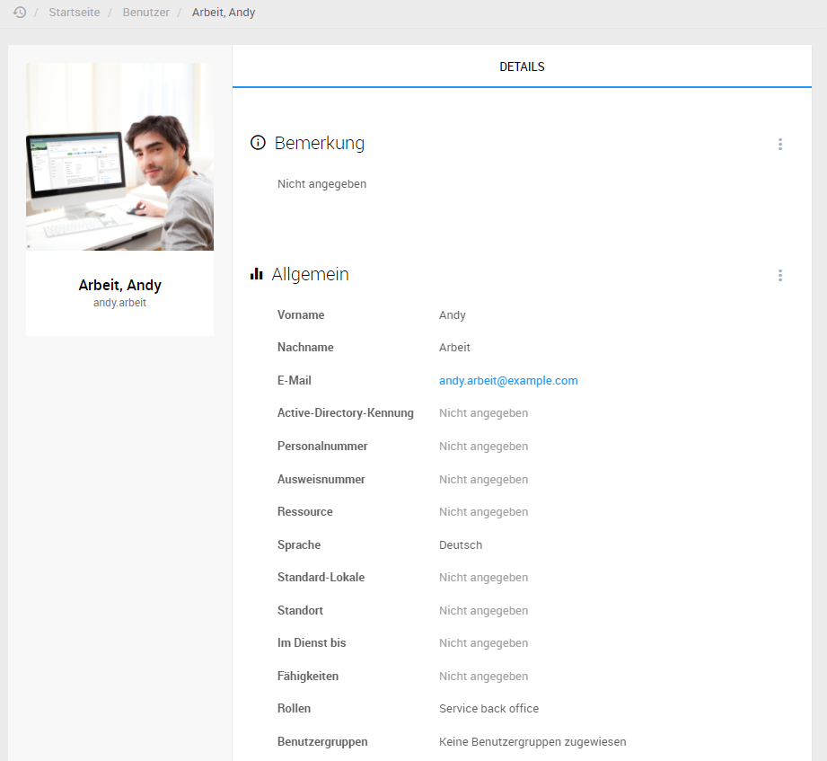

### Passwort zurücksetzen
Es ist möglich das Passwort für jeden Benutzer zurückzusetzen. Dies kann beispielsweise erforderlich sein, wenn der Benutzer sein Passwort vergessen hat.

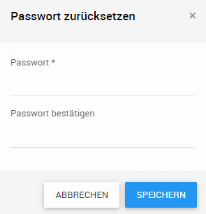

----
**Hinweis** Bitte beachten Sie die Passwort Restriktionen, wie die erforderliche Anzahl der Zeichen.

----

### Neuen Benutzer anlegen
In der Benutzerliste befindet sich die Schaltfläche zum Anlegen eines neuen Benutzers.

Weitere Informationen zu den möglichen Eingaben beim Anlegen eines Benutzer finden Sie im Kapitel [Benutzerbezogene Daten](#user-manager.user-data).

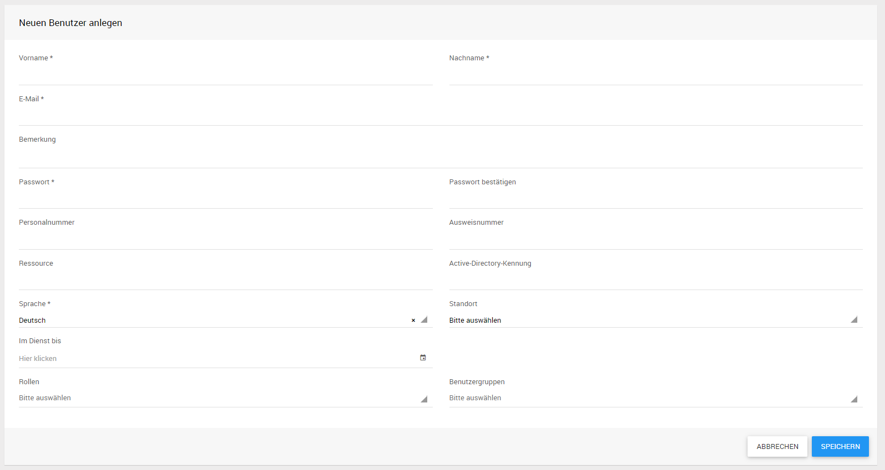

## User-Cache aktualisieren
Diese Schaltfläche befindet sich im Schnellzugriff über der Benutzerliste.

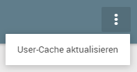

### Was ist der User-Cache?
Der User-Cache ist ein Speicher, in den alle Benutzer geladen werden. Möchte sich ein Benutzer anmelden, so wird im User-Cache nachgesehen, ob dieser dort registriert ist und die richtige Anmeldedaten eingegeben hat.

### Wann sollte ich den User-Cache aktualisieren?
Das Anlegen und Bearbeiten von Benutzern kann neben der Benutzerverwaltung auch direkt über Datenbankimports geschehen. Diese Änderungen bekommt die Anwendung nicht per se mit. Durch Ausführen der Funktion *User-Cache aktualisieren* wird der User-Cache neu, aus den Benutzerdaten aus der Datenbank, erstellt.

## Persönliche Benutzereinstellungen
Im Navigationsbereich befindet sich die Schaltfläche *Meine Infos* mit dieser jeder Benutzer persönliche Benutzereinstellungen vornehmen kann.

----
**Hinweis** Weitere Informationen zu den persönlichen Benutzereinstellungen finden Sie im Kapitel [Meine Infos](#my-info.my-info).

----

## Rollen {#user-manager.rolls}
Rollen bilden organisatorischen Einheiten des Unternehmens ab. Beispiele für Rollen sind *Adminstrator* oder *Service-Innendienst*. Mit diesen Rollen können dann wiederum Berechtigungen verknüpft werden, welche die Person, die über die Rolle verfügt zur ihrer Arbeit mit der Anwendung benötigt.

Dieses Kapitel befasst sich mit dem praktischen Teil der Zugriffssteuerung mit Hilfe von Rollen, z.B. wie neue Rollen hinzugefügt werden.

----
**Hinweis** Konzeptionelle Informationen zu dem Zugriffssteuerungsmodell finden Sie im Kapitel [Zugriffssteuerungsmodell](#user-manager.authorization-model)

----

Die Rollen sind im *Burger-Menü unter *Verwaltung* - *Rollen & Berechtigungen* zu finden

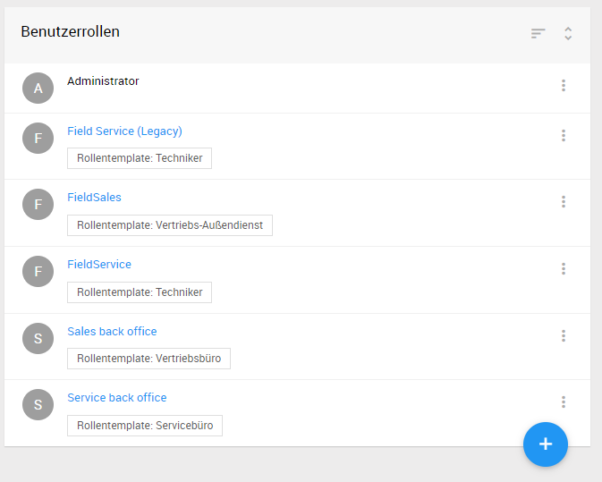

### Vordefinierte Rollen
Im Auslieferungszustand der Anwendung gibt es bereits vordefinierte Rollen. Abhängig von den aktiven Plug-Ins können unterschiedliche vordefinierte Rollen vorhanden sein.
Grundsätzlich werden zwei verschiedene Arten von vordefinierten Rollen unterschieden. Es gibt vordefinierte Rollen, die Sie frei nach Ihren Bedürfnissen anpassen und auch löschen können. Diese Rollen stellen lediglich Beispiele dar, die Sie als Grundlage nehmen können. Zum anderen gibt es vordefinierte Rollen die per se mit Funktionen belegt sind. So ist beispielsweise ein Benutzer, der die Rolle *Techniker* hat in der Plantafel einplanbar (erfordert aktives Plug-In Sms.Scheduler).

Die folgende Tabelle zeigt die Plug-Ins und die dazugehörigen vordefinierten Rollen.

| Main             | Crm.Service        | Crm.Order / Crm.Visitreport | Sms.Scheduler |
|------------------|--------------------|------------------------------|--------------------|
| Administrator*   | Service-Innendienst| Vertriebsleitung             | Einsatzplaner*     |
| API Benutzer     | Service Leitung    | Vertriebs-Außendienst        | Disponent          |
| Lizenzverwaltung | Techniker*         | Vertriebs-Innendienst        | PT-Readonly        |

(*) Rollen mit erweiterter Funktionalität

Beschreibung zu Rollen mit erweiterter Funktionalität:

**Administrator**

Benutzer mit der Rolle Adminstrator besitzen alle Berechtigungen.

**Techniker**

Benutzer mit der Rolle Techniker können sich am mobilen Crm/Service Endgerät anmelden.

**Einsatzplaner**

Benutzer mit der Rolle Einsatzplaner können sich an der Plantafel anmelden.

**Disponent**

Benutzer mit der Rolle Disponent können Profile in der Plantafel nur betrachten.

**PT-Readonly**

Benutzer mit der Rolle PT-Readonly haben nur lesenden Zugriff auf die Plantafel.

**Berechtigungen**

Vordefinierte Rollen werden mit Berechtigungen vorbelegt, die für diese Rolle sinnvoll sind. Diese Berechtigungen können individuell angepasst werden. Die folgende Tabelle zeigt Beispiele *Vordefinierter Rollen* und Berechtigungen die diesen standardmäßig beim ersten Start der Anwendung hinzugefügt werden.

Vordefinierte Rolle | Plug-In | Berechtigung
--- | --- | ---
Vertriebsleiter | Crm.Order | Artikel löschen
Vertriebsleiter | Crm.Order | Artikel anlegen
Vertriebsleiter | Crm.Order | Artikel bearbeiten
Vertriebsleiter | Crm.Order | Auftrag anlegen
Vertriebsleiter | Crm.Order | Auftrag abschließen
Vertriebsleiter | Crm.Order | Auftrag versenden
Vertriebsleiter | Crm.Order | ...
Service-Innendienst | Crm.Service | Serviceauftrag anlegen
Service-Innendienst | Crm.Service | Serviceauftrag bearbeiten
Service-Innendienst | Crm.Service | Serviceauftrag Material anlegen
Service-Innendienst | Crm.Service | Serviceauftrag Material bearbeiten
Service-Innendienst | Crm.Service | ...

### Rollen hinzufügen

Navigieren Sie ins **Burger-Menü-> Verwaltung -> Rollen & Berechtigungen**. 
Über die Plus-Schaltfläche in der Rollenübersicht kann eine neue Rolle angelegt werden.

Vergeben Sie einen eindeutigen Namen für die neue Rolle und wählen Sie optional ein Rollentemplate aus, dessen Berechtigungen die neue Rolle bekommen soll.

### Bestehende Rollen bearbeiten
Eine bereits bestehende Rolle können Sie bearbeiten, indem Sie in der Listenansicht der Rollen die entsprechende Rolle auswählen.

Die im System verfügbaren Berechtigungen sind abhängig von den aktiven Modulen und werden nach Modul gruppiert dargestellt.
**Die einzelnen Berechtigungen bestehen meist aus den Optionen zum Erstellen, Löschen oder Lesen eines Elements innerhalb eines Moduls** z.B. .Crm -> Note -> Haken bei View -> Rolle kann Notizen lesen. Ist kein haken bei create oder delete kann die Rolle nur Notizen einsehen.

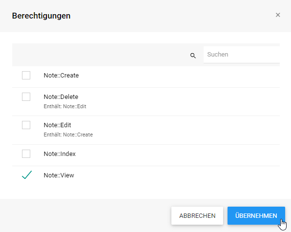

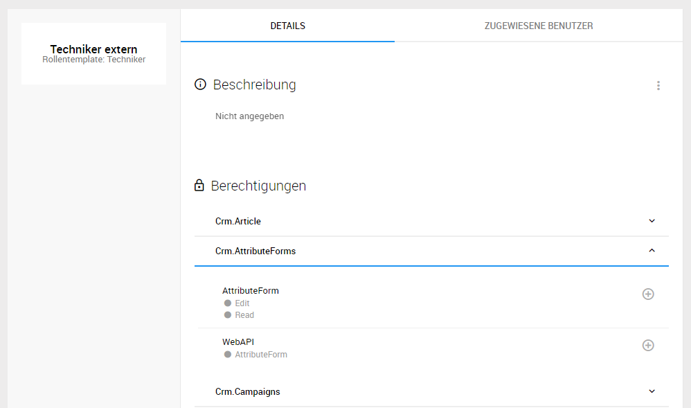

Wurde die Rolle aus einem Rollentemplate erstellt, werden die Änderungen die seitdem an der Rolle vorgenommen wurden farblich hervorgehoben.

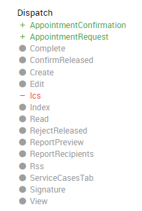

Soll eine Rolle auf den Stand des Rollentemplates zurückgesetzt werden, kann diese über die Aktion *Zurücksetzen* auf den Ursprungszustand zurückgesetzt werden.

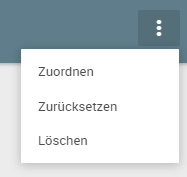

Im Reiter *Zugewiesene Benutzer* befindet sich eine Auflistung aller Benutzer in dieser Rolle. Von dort können weiter Benutzer der Rolle hinzugefügt, oder bestehende wieder entfernt werden.

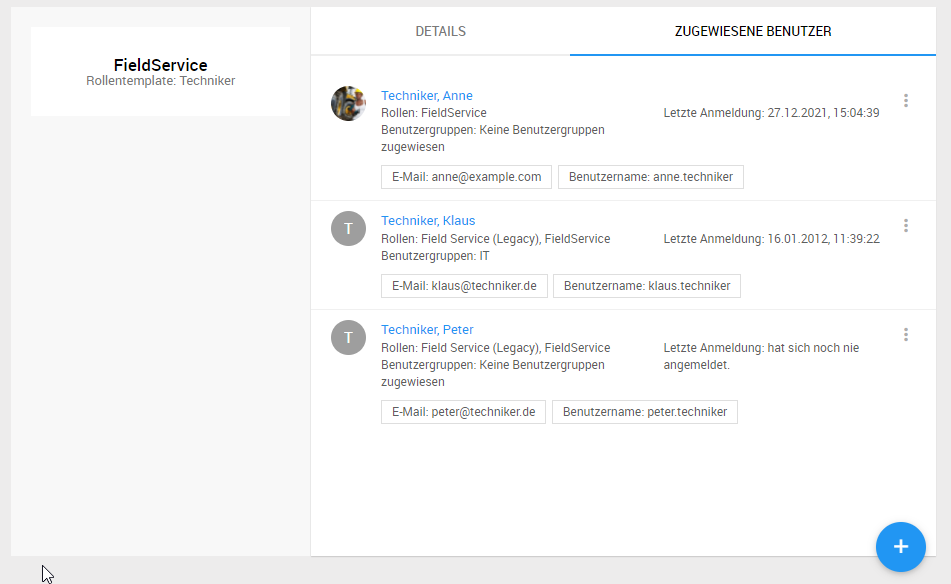

## Benutzergruppen {#user-manager.user-groups}
Dieses Kapitel befasst sich mit dem praktischen Teil der Zugriffssteuerung mit Hilfe von Benutzergruppen, z.B. wie neue Benutzergruppen hinzugefügt werden.

----
**Hinweis** Konzeptionelle Informationen zu dem Zugriffssteuerungsmodell finden Sie im Kapitel [Zugriffssteuerungsmodell](#user-manager.authorization-model)

----

Um die Benutzergruppenverwaltung zu öffnen navigieren sie über das **Burger-Menü-> Verwaltung -> Benutzergruppen**.

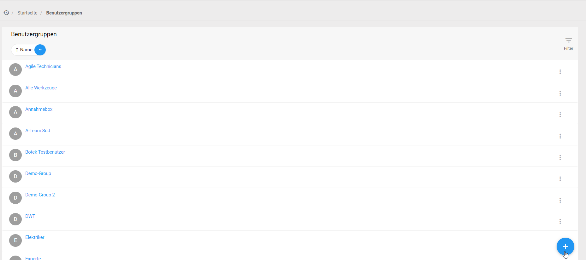

### Benutzergruppen hinzufügen
In der Liste wird nach dem Öffnen der Rollenliste die Plus Schaltfläche zum *Hinzufügen* sichtbar.

Vergeben Sie einen eindeutigen Namen für die neue Benutzergruppe.

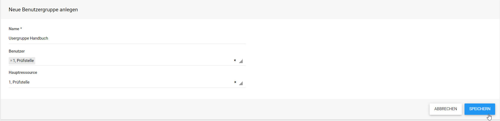

### Bestehende Benutzergruppen bearbeiten

Öffnen Sie eine Benutzergruppe in der Listenansicht, mit dem *Stiftsymbol* können Sie die Details (Mitglieder/Werkzeuge) der Benutzergruppe bearbeiten.

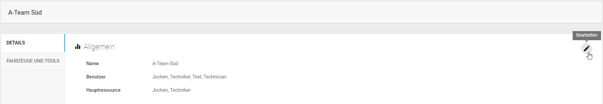

Es besteht die Möglichkeit, Techniker einer Benutzergruppe zuzuordnen und dabei die Haupt-Ressource zu definieren:

Die Hauptressource beeinflusst die Team-Einsatzplanung. Siehe Kapitel Teamplanung

### Fahrzeuge und Werkzeuge zuordnen

Wenn sie eine Benutzergruppe bearbeiten können Sie auch *Werkzeuge* zuordnen, öffnen Sie den Reiter *Fahrzeuge und Werkzeuge*,  dort können Sie mit dem Plussymbol neue Fahr- und Werkzeuge dieser Benutzergruppe zuordnen.

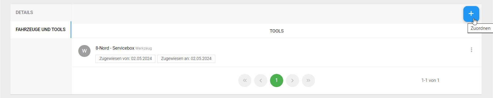

## Benutzerverwaltung / Standorte
Durch die Verwendung von Standorten ist es Ihnen möglich Ihre Unternehmenseinheiten standortabhängig abzubilden. Dazu können Sie in der Benutzerverwaltung Ihre Standorte definieren und diese Ihren Mitarbeitern zuordnen.
In diesem Kapitel wird die Erstellung von Standorten beschrieben. Die Zuordnung von Standorten zu Benutzern erfolgt ebenfalls in der Benutzerverwaltung. Bitte sehen Sie dazu das Kapitel [Benutzer](#user-manager.user).

Unter *Burger-Menü -> Stammdaten -> Standorte* können Sie die Auflistung der Standorte einsehen.

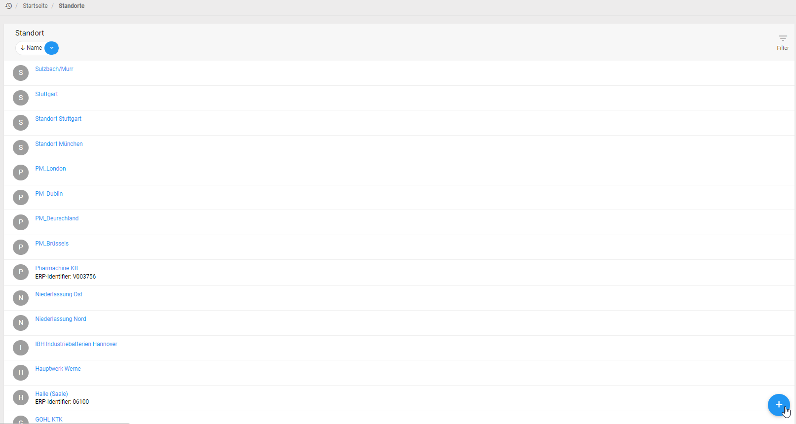

Sie können die Standorte Filtern.

### Standorte hinzufügen
Im Kontextbereich wird nach dem Öffnen der Standortliste das Plussymbol für das *Hinzufügen* sichtbar.

Vergeben Sie einen eindeutigen Namen für den neuen Standort. Wenn notwendig können Sie mit Hilfe der **Legacy Id** diesen Standort mit dem Standort in einem angeschlossen ERP-System koppeln. Ist dies nicht erforderlich, so können Sie dieses Eingabefeld leer lassen.

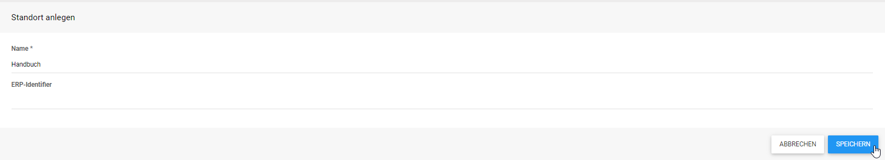

### Bestehende Standorte bearbeiten / löschen
Mit der Funktion *Bearbeiten*, die sich als Stiftsymbol rechts in den Details des Standortes befindet können Sie diesen ändern. Öffnen Sie dafür den Standort in der Liste.

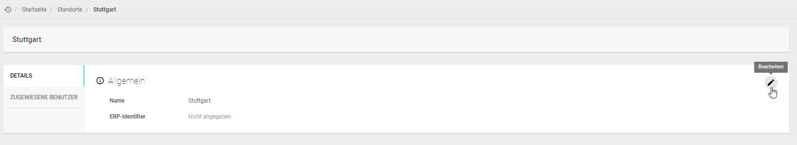

## Benutzerverwaltung / Fähigkeiten

Unter Fähigkeiten werden technische Fähigkeiten, wie z.B. Kenntnisse in Elektrik, Hydraulik usw. verstanden.
Die Verwendung von Fähigkeiten bietet Ihnen bei der Einsatzplanung von Mitarbeitern einen großen Vorteil, denn Sie können dadurch sehr einfach den Mitarbeiter auswählen, der aufgrund seiner Fähigkeiten, für die Bearbeitung eines Auftrags am besten geeignet ist.

Zum öffnen der Fähigkeiten Liste navigieren Sie zum **Burger-Menü-> Verwaltung -> Zuordnungstabelle -> Fähigkeiten**.

----
**Hinweis** Detailliertere Informationen finden Sie im Kapitel [Planungsvorrat](#scheduler.pipeline).

----

Im Kontextbereich lässt sich die Auflistung der Fähigkeiten aufklappen.

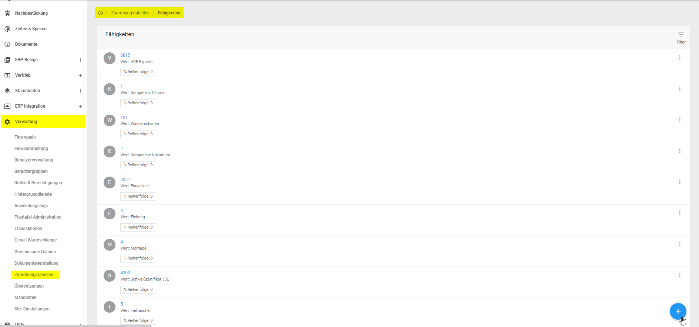

### Hinzufügen / Bearbeiten

Im Kontextbereich wird nach dem Öffnen der Fähigkeitenliste das *Plussymbol* zum *hinzufügen* neuer Fähigkeiten sichtbar.

Nach dem Betätigen der Schaltfläche im Namen der Fähigkeit  öffnet sich ein Formular zum Bearbeiten der Fähigkeit.

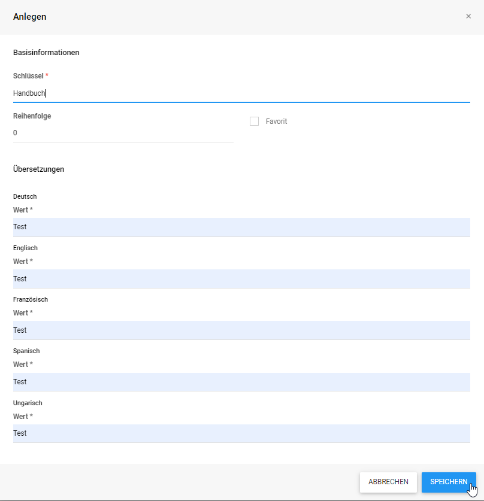

### Zuordnen

Um die in der Zuordnungstabelle erstellten Fähigkeiten  den Mitarbeitern zuzuordnen, gehen Sie wie folgt vor:

1. Navigieren Sie im Burger-Menü zur Verwaltung
2. Navigieren Sie zur Benutzerverwaltung
3. Wählen Sie den Mitarbeiter aus
4. Navigieren Sie zum Fähigkeitenreiter
5. Führen Sie das Plussymbol aus
6. Fähigkeiten auswählen
7. Speichern Sie
    

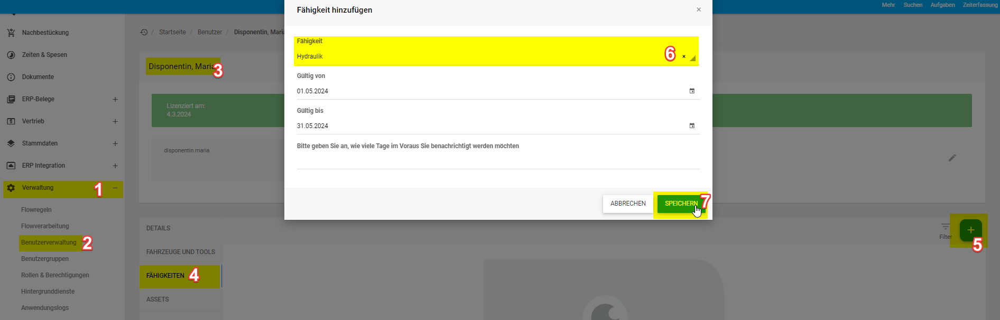

## Konfiguration (Administration)
Die folgende Tabelle zeigt verschiedene Einstellungen die in der *web.Template.config* Datei vorgenommen werden können.

Parameter | Beschreibung
--- | ---
\<configuration> &ensp;\<connectionStrings> &emsp;\<add name="ActiveDirectory" connectionString="LDAP://example.com:389" /> &ensp;\</connectionStrings> <\configuration> | Verbindungszeichenfolge für ActiveDirectory
\<configuration> &ensp;\<appSettings> &emsp;\<add key="UseActiveDirectoryAuthenticationService" value="false" /> &ensp;\</appSettings> <\configuration> | Aktivierung von ActiveDirectory

# Flow Plugin - Flow-Prozessor

Das Flow Plugin ermöglicht es Ihnen, Regeln und Prozesse zu erstellen, ohne direkt in den Code der l-mobile Software einzugreifen. Es definiert zwei Hauptentitäten: `FlowRule` und `FlowItem`.

## FlowRule

Eine `FlowRule` legt fest, wann ein Endpunkt aufgerufen werden soll. Sie besteht aus drei Pflichteigenschaften:

- `EntityType`: Der Typ der Entität (alle Entitäten aus `dbo.EntityType`)
- `Action`: Erstellen, ändern oder löschen
- `Endpoint`: Der aufzurufende Endpunkt

## FlowItem

Ein `FlowItem` ist ein Eintrag für die Änderung. Es erbt von `Posting`, erweitert dieses jedoch. Immer wenn eine Entität geändert wird (erstellt, modifiziert oder gelöscht), sucht die Anwendung nach einer `FlowRule` für den spezifischen Typ und die Aktion. Wenn eine Regel vorhanden ist, wird ein `FlowItem` erstellt, welches den `FlowProcessingService` auslöst.

## Neue Flowregel erstellen

Um eine neue Flowregel zu erstellen, navigieren Sie zum **Burger-Menü -> Verwaltung -> Flowregeln -> Pluszeichen**. Es öffnet sich ein Formular, in dem Sie eine Entität und eine Aktion auswählen. Die Beschreibung ist optional. Legen Sie einen festen Endpunkt fest, z.B. `Localhost:8866`. Für erhöhte Sicherheit vergeben Sie einen Benutzernamen und ein Passwort.

**Wichtig:** Ein erfolgreicher Request sollte den **HTTP-Code 200** zurückgeben. Andernfalls wird dies als fehlgeschlagen betrachtet.

Wenn der `FlowProcessingService` ausgelöst wird, fragt er alle `FlowItems` ab, die als ausstehend oder fehlgeschlagen markiert sind. 

## Auslösen des Services

Wenn der `FlowProcessingService` ausgelöst wird, fragt er alle `FlowItems` ab, die als Pending oder Failed markiert sind. Für jedes `FlowItem` wird dann ein POST-Request an den entsprechenden Endpoint gesendet, wobei der Request-Body das `FlowItem` im JSON-Format enthält.

## Mögliche Ergebnisse

Es gibt drei mögliche Ergebnisse, die im `State` gespeichert werden:
- `Processed`: Wenn die Verarbeitung erfolgreich ist.
- `Failed`: Bei Fehlern während der Verarbeitung wird der Fehler in den `StateDetails` gespeichert und als Failed markiert, damit es beim nächsten Ausführen des Services erneut verarbeitet wird.
- `Blocked`: Wenn die Verarbeitung mehrmals fehlschlägt, wird es als Blocked markiert und nicht weiter verarbeitet. Die Anzahl der Wiederholungen, bevor ein `FlowItem` blockiert wird, kann konfiguriert werden.

## Konfiguration

In der Datei `Main.Flow/jobs.xml` kann konfiguriert werden, wie oft der `FlowProcessingService` ausgeführt wird, indem der Cron-Ausdruck modifiziert wird. In der Datei `Main.Flow/appSettings.config` können folgende Einstellungen vorgenommen werden:
- `MaxRetries`: Legt fest, wie viele Verarbeitungsversuche unternommen werden können, bevor ein `FlowItem` als blockiert markiert wird.
- `FlowProcessingEndpoint`: Legt den Endpoint fest, an den das `FlowItem` gesendet werden muss.